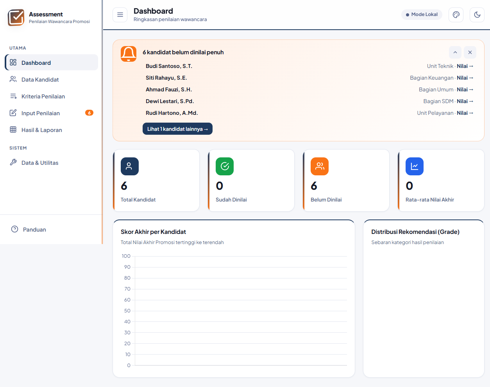
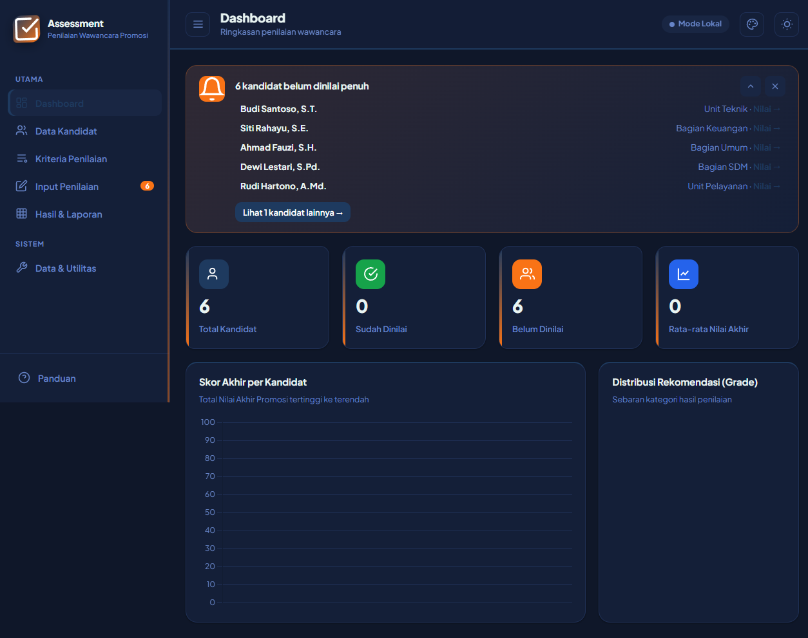
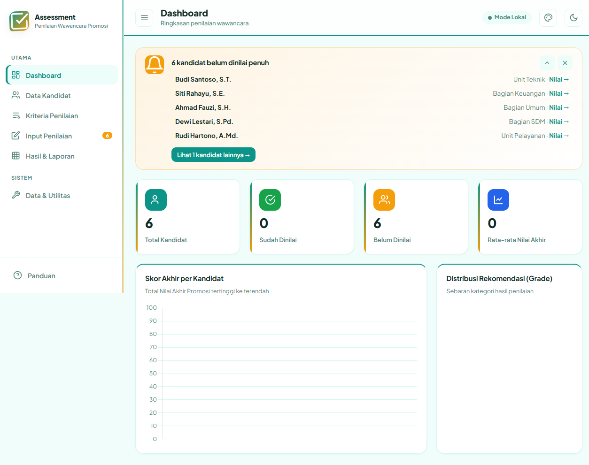
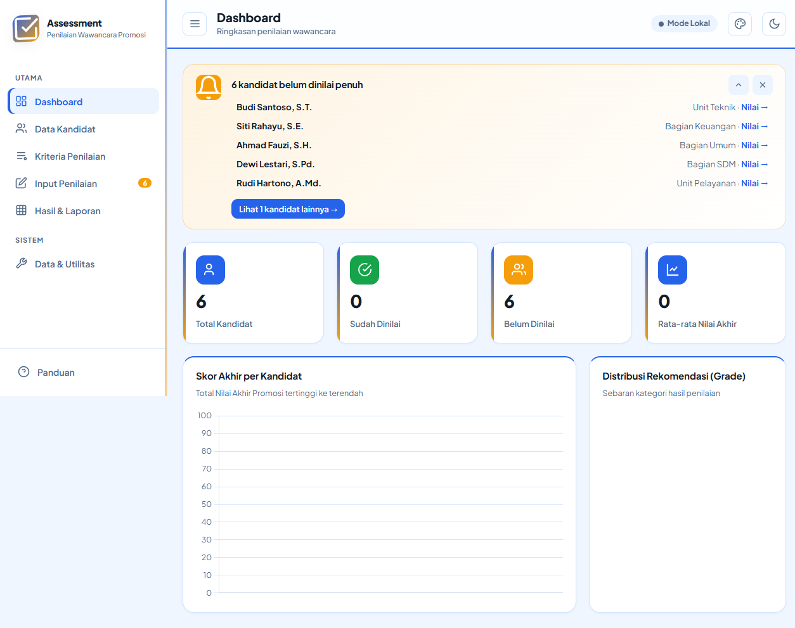
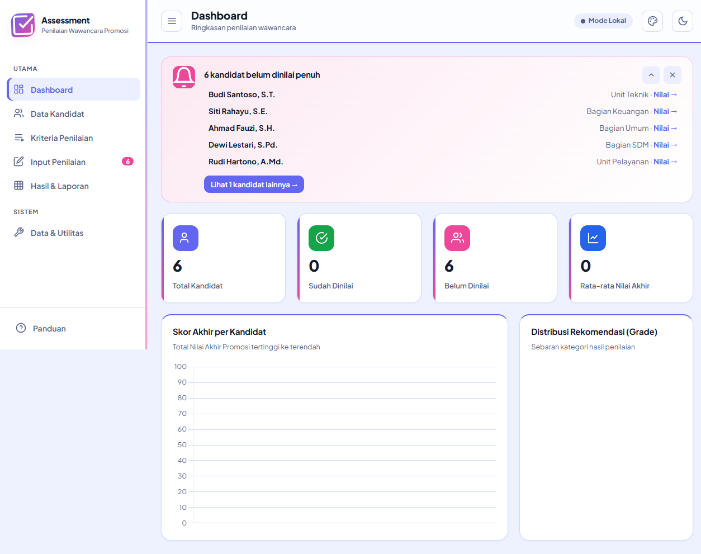
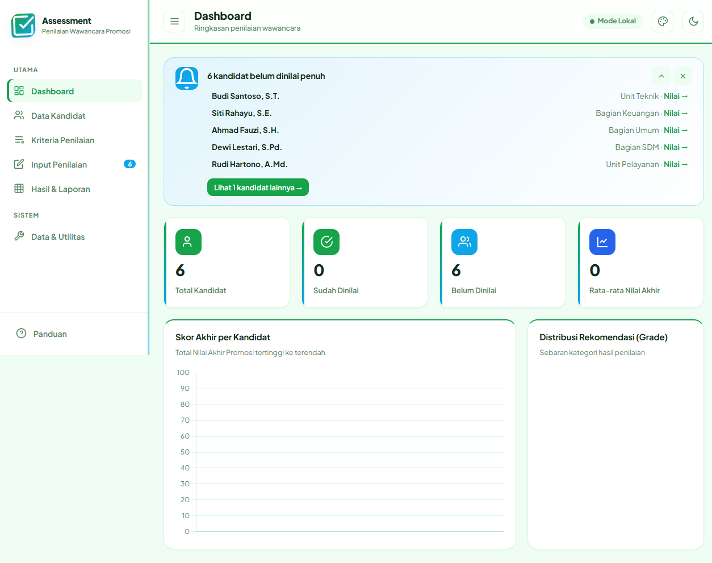
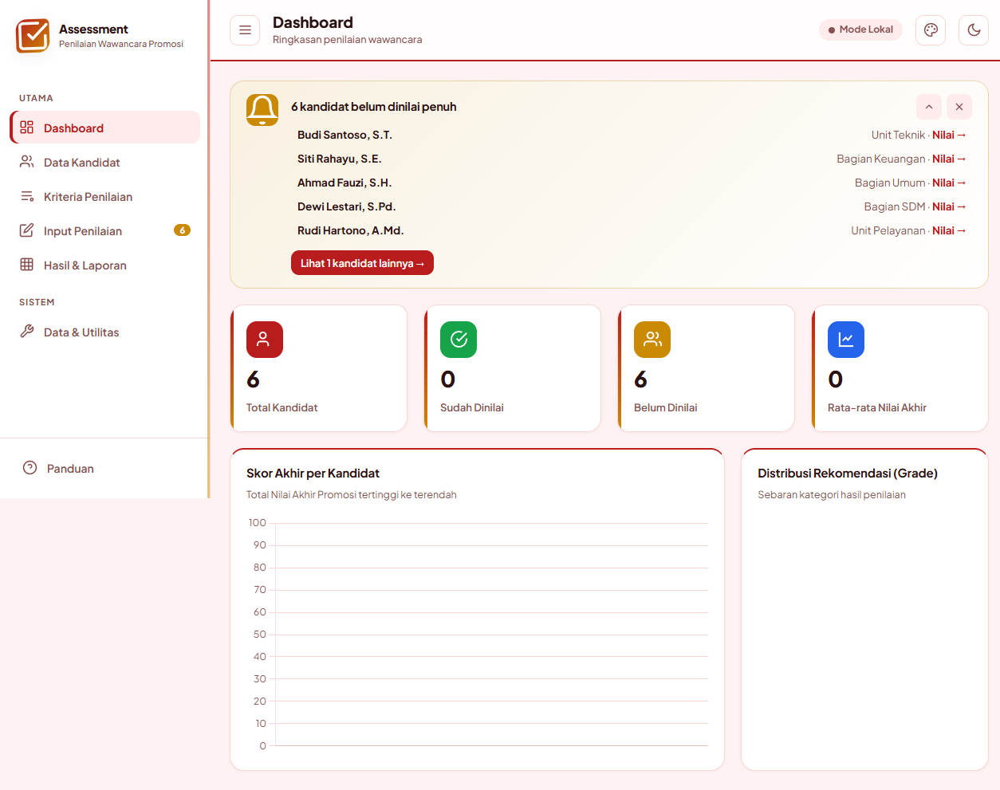
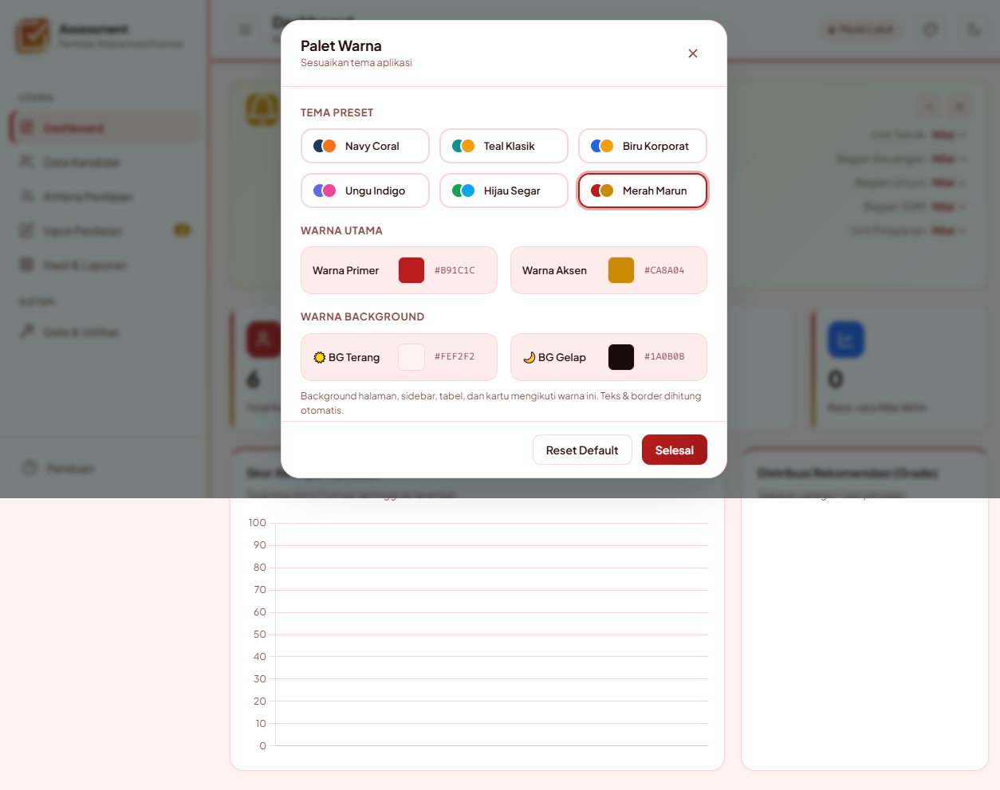

# Asesmen Promosi — Penilaian Wawancara Kandidat

Aplikasi untuk mendampingi proses penilaian wawancara promosi jabatan, dibuat sebagai satu file HTML yang bisa langsung dipakai tanpa perlu menginstal apa pun. Tinggal dibuka di browser, datanya masuk, dan hasilnya bisa dicetak. Cocok dipakai oleh tim kecil yang selama ini mengisi formulir penilaian secara manual.


---

## Isi Aplikasi

| Bagian | Fungsinya |
|--------|-----------|
| **Dashboard** | Ringkasan jumlah kandidat, yang sudah dinilai, rata-rata nilai, grafik nilai akhir, dan daftar kandidat yang belum dinilai (bisa diklik langsung untuk menilai) |
| **Data Kandidat** | Daftar calon dengan NIK, jabatan asal, usulan jabatan, dan unit kerja. Bisa dicari, difilter, ditambah, diedit, dan dihapus |
| **Kriteria Penilaian** | Aspek wawancara per jenjang jabatan lengkap dengan bobot. Kategori (usulan jabatan) bisa diubah nama, ditambah, atau dihapus |
| **Input Penilaian** | Form isian skor wawancara 1–5 per kompetensi plus komponen lain (psikotes, kinerja, TPA) skala 0–100. Nilai akhir dihitung otomatis mengikuti komposisi bobot |
| **Hasil & Laporan** | Rekap nilai akhir dengan grade, bisa dicetak, dan ada berita acara per kandidat |
| **Data & Utilitas** | Backup/restore JSON, export CSV untuk Excel, dan reset data |

## Hal-hal yang memudahkan

- Komposisi bobot bisa diatur per kategori (misal wawancara 35%, psikotes 25%, dst.) — totalnya terpantau langsung saat diedit
- Tercatat tanggal penilaian wawancara dan komponen lain secara terpisah, jadi tidak bingung siapa dinilai kapan
- Kandidat bisa diimpor dari file Excel (memahami kolom NAMA, NIK, JABATAN, UNIT KERJA dan menebak usulan jabatan dari nama sheet), atau dari file JSON
- Kriteria bisa diexport dan diimpor antar komputer — file exportnya ikut membawa komposisi bobot
- Export nilai per kandidat agar teman yang menilai di tempat lain bisa mengirim hasilnya dalam satu file
- Semua hapusan punya tombol "Urungkan" di notifikasi, jadi salah hapus tidak berabe
- Tema bisa diubah: enam preset warna, atau atur sendiri warna utama, aksen, dan latar terang/gelap

## Cara Pakai

1. Unduh `penilaian-wawancara.html`, lalu buka dengan double-click di browser mana pun (Chrome, Edge, Firefox).
2. Isi daftar kandidat — bisa ketik satu per satu lewat tombol **Tambah Kandidat**, atau impor dari file Excel/JSON.
3. Pastikan kriteria tiap kategori sudah sesuai (bobot wawancara tiap kategori idealnya 100%).
4. Masuk ke **Input Penilaian**, pilih kandidat, isi skor, lalu **Simpan Penilaian**.
5. Lihat hasilnya di **Hasil & Laporan**, cetak berita acara atau rekapnya.
6. Rajin-rajinlah **Export Backup** di menu Data & Utilitas supaya ada cadangan.

> Data yang tampil di aplikasi ini adalah **data contoh** (dummy). Data kandidat dan kriteria bawaan bisa diganti dengan cara membuka file di editor teks, lalu cari bagian `DEFAULT_PEJABAT` dan `DEFAULT_KRITERIA` di dalam file, dan sesuaikan isinya. Simpan, buka kembali di browser — data baru langsung muncul (untuk benar-benar bersih, hapus data lama lewat tombol "Muat Ulang Data Awal" di Data & Utilitas).

## Cara Kerja Penyimpanan

Semua data disimpan di **localStorage browser** — tidak ada server, tidak ada internet, tidak ada akun. Artinya:

- Buka file ini di komputer lain, datanya tidak ikut pindah — gunakan **Export/Import Backup JSON** untuk memindahkan data.
- Membersihkan data browser (atau membuka mode penyamaran) akan menghapus data yang tersimpan di browser itu.

Version publik ini sengaja dipisahkan kunci penyimpanannya dari versi internal, jadi aman dipakai berdampingan.

## Teknis Singkat

| Bagian | Keterangan |
|--------|------------|
| Bahasa | HTML5 + CSS3 + JavaScript (ES6+), satu file tanpa build |
| Grafik | Chart.js 4.4.1 dari CDN |
| Export Excel | SheetJS (xlsx) dari CDN |
| Penyimpanan | localStorage |
| Font | Plus Jakarta Sans & Fira Code (Google Fonts) |
| Responsif | Menyesuaikan layar HP maupun monitor |

Aplikasi ini mungkin butuh koneksi internet sekali waktu untuk memuat pustaka grafik/excel dari CDN; tanpa internet fitur inti (input nilai, tabel, cetak) tetap berjalan, hanya grafik dashboard yang tidak muncul.

## Tampilan Aplikasi

### Dashboard

*Halaman utama: kartu ringkasan, daftar kandidat yang belum dinilai (bisa langsung diklik), dan grafik.*

### Mode Gelap

*Mode gelap dengan latar navy — nyaman dipakai di ruangan minim cahaya.*

### Galeri Tema

| Navy Coral | Teal Klasik | Biru Korporat |
|-----------|------------|---------------|
|  |  |  |

| Ungu Indigo | Hijau Segar | Merah Marun |
|------------|-------------|-------------|
|  |  |  |

### Pengaturan Warna

*Enam preset tema, plus warna primer, aksen, dan latar terang/gelap bisa diatur sendiri.*

## Struktur Repositori

```
penilaian-wawancara/
├── penilaian-wawancara.html   ← Aplikasi utama (satu file)
├── README.md                  ← Dokumentasi ini
├── LICENSE                    ← Lisensi MIT
└── docs/                      ← Screenshot tampilan aplikasi
```

## Lisensi

MIT — silakan dipakai, disesuaikan, dan dikembangkan. Kalau dipakai di instansi atau kantor, tinggal ganti data kandidat, kriteria, dan kop berita acaranya dengan milik sendiri.